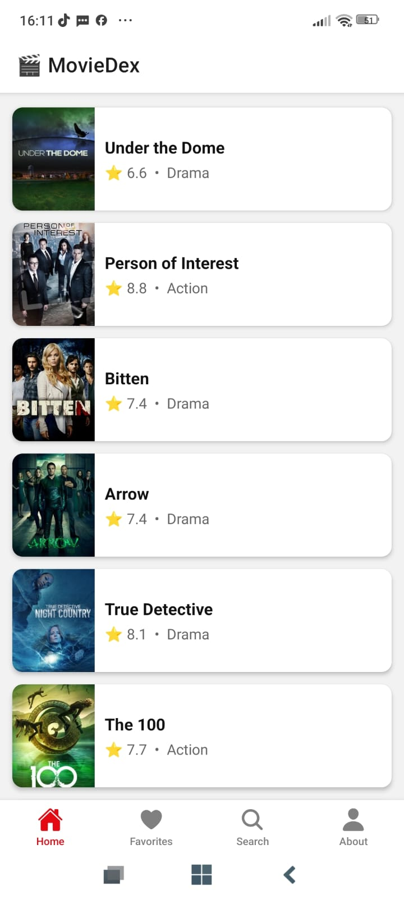
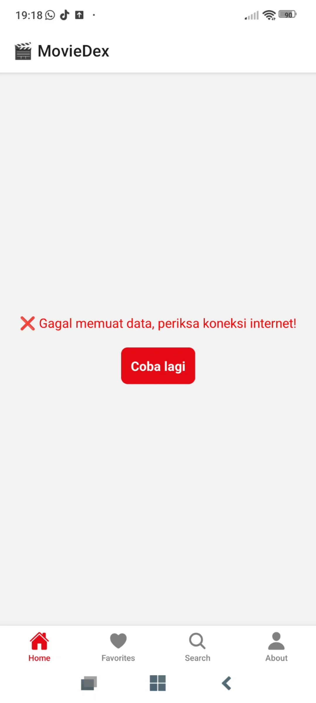
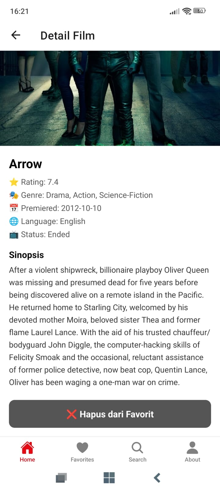
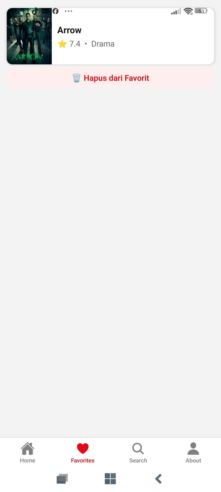
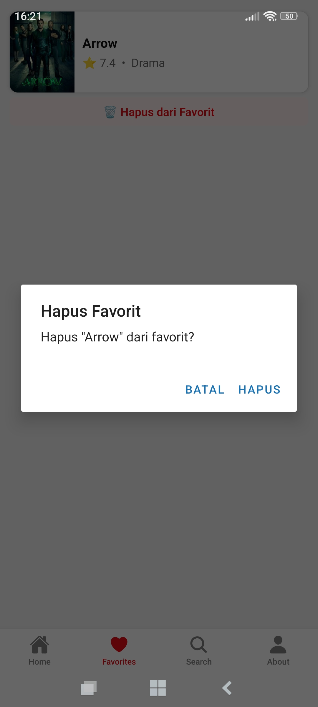
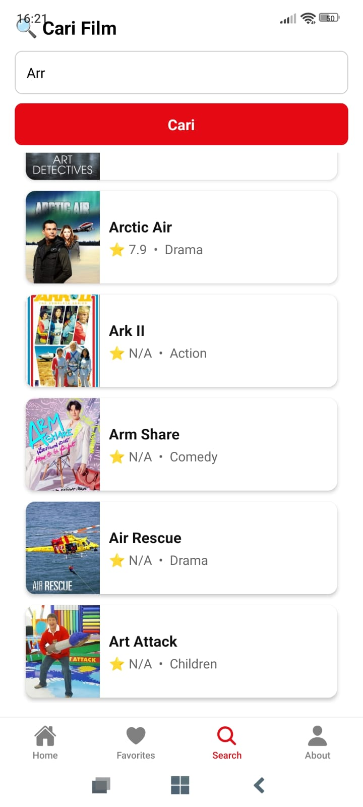
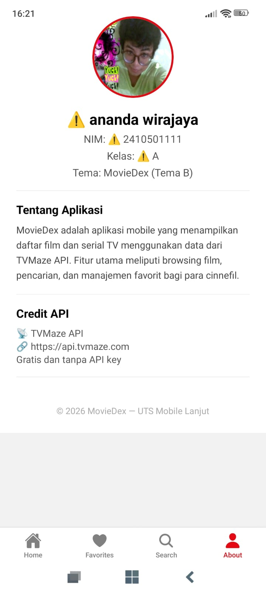

># MovieDex 🎬

Aplikasi mobile untuk browsing dan mencari film/serial TV menggunakan TVMaze API.

## Identitas
- **Nama:**  Ananda Wirajaya
- **NIM:**  2410501111
- **Kelas:**  A
- **Tema:** Tema B — MovieDex (api.tvmaze.com)

## Tech Stack
- React Native + Expo SDK (stable)
- @react-navigation/native + stack + bottom-tabs
- Context API + useReducer (state management)
- fetch() untuk API integration
- JavaScript

## Cara Install & Run

```bash
# 1. Clone repo
git clone https://github.com/nandaa212/uts-mobile-lanjut-2410501111-anandawirajaya.git

# 2. Masuk folder
cd uts-mobile-lanjut-2410501111-anandawirajaya

# 3. Install dependencies
npm install

# 4. Jalankan
npx expo start
```

Scan QR code dengan Expo Go di HP.

## Screenshots


**Home Screen**


**error Screen**


**refresh Screen**


**Detail Screen**


**Favorites Screen**


**hapus Screen**


**Search Screen**


**About Screen**



## Video Demo
 [Link Video Demo](https://drive.google.com/drive/folders/1RetSUbpIwAQkCn8EhDCiIOLmlDpSLifY)

## Justifikasi State Management
Saya memilih Context API + useReducer karena:
1. Cocok untuk skala aplikasi kecil-menengah seperti MovieDex
2. Sudah built-in di React, tidak perlu install library tambahan
3. useReducer membuat perubahan state lebih terstruktur dan mudah di-debug
4. Cukup untuk mengelola state favorites tanpa kompleksitas Redux

## Daftar Referensi
- [TVMaze API Documentation](https://www.tvmaze.com/api)
- [React Navigation Docs](https://reactnavigation.org/docs/getting-started)
- [Expo Documentation](https://docs.expo.dev)
- [React Native Docs](https://reactnative.dev/docs/getting-started)
- [video tutorial](https://youtu.be/orInkP7t9WI?si=tnMBCm34gbdSRHhp)
- [video tutorial](https://youtu.be/4wF3uS6BY90?si=Cmt-O3hY6PT41M-6)

## Refleksi
Selama mengerjakan UTS ini saya belajar bagaimana membangun 
aplikasi mobile dengan React Native dari awal. Tantangan terbesar 
adalah memahami konsep navigation yang menggabungkan Stack Navigator 
dan Bottom Tab Navigator secara bersamaan. Saya juga belajar 
bagaimana mengintegrasikan API eksternal yaitu TVMaze API menggunakan 
fetch() dengan menangani loading state dan error handling. 
Penggunaan Context API dengan useReducer membantu saya memahami 
konsep state management yang lebih terstruktur dibanding useState biasa. 
Proses debugging error seperti "Unable to resolve module" mengajarkan 
saya pentingnya struktur folder yang rapi. Secara keseluruhan project 
ini memberikan pengalaman nyata dalam membangun aplikasi mobile 
yang lengkap dengan fitur CRUD favorit, pencarian, dan navigasi 
antar halaman.